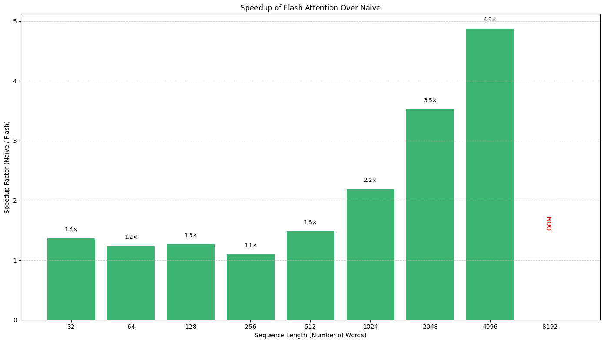

# Installation

To begin using the GLiNER model, you can install the GLiNER Python library through pip, conda, or directly from the source.


## Install via Pip

```bash
pip install gliner
```
:::tip[ONNX runtime]
If you intend to use the GPU-backed ONNX runtime, install GLiNER with the GPU feature. This also installs the `onnxruntime-gpu` dependency.
:::
```bash
pip install gliner[gpu]
```

## Install via Conda

```bash
conda install -c conda-forge gliner
```

## Install from Source

To install the GLiNER library from source, follow these steps:

1. **Clone the Repository:**

   First, clone the GLiNER repository from GitHub:

   ```bash
   git clone https://github.com/urchade/GLiNER
   ```

2. **Navigate to the Project Directory:**

   Change to the directory containing the cloned repository:

   ```bash
   cd GLiNER
   ```

3. **Install Dependencies:**
   :::tip
   It's a good practice to create and activate a virtual environment before installing dependencies:
   :::

   ```bash
   python -m venv venv
   source venv/bin/activate   # On Windows use: venv\Scripts\activate
   ```

   Install the required dependencies listed in the `requirements.txt` file:

   ```bash
   pip install -r requirements.txt
   ```

4. **Install the GLiNER Package:**

   Finally, install the GLiNER package using the setup script:

   ```bash
   pip install .
   ```

5. **Verify Installation:**

   You can verify the installation by importing the library in a Python script:

   ```python
   import gliner
   print(gliner.__version__)
   ```
---
## Install FlashDeBERTa

Most GLiNER models use the DeBERTa encoder as their backbone. This architecture offers strong token classification performance and typically requires less data to achieve good results. However, a major drawback has been its slower inference speed, and until recently, there was no flash attention implementation compatible with DeBERTa's disentangled attention mechanism.

To address this, [FlashDeBERTa](https://github.com/Knowledgator/FlashDeBERTa) was introduced.

To use `FlashDeBERTa` with GLiNER, install it:

```bash
pip install flashdeberta -U
```
:::tip
Before using FlashDeBERTa, please make sure that you have `transformers>=4.47.0`.
:::

GLiNER will automatically detect and use `FlashDeBERTa`. If needed, you can switch to the standard `eager` attention mechanism by specifying the attention implementation:

```python
model = GLiNER.from_pretrained("urchade/gliner_mediumv2.1", _attn_implementation="eager")
```

`FlashDeBERTa` provides up to a 3× speed boost for typical sequence lengths—and even greater improvements for longer sequences.
