# Intro
GLiClass (Generalist and Lightweight Model for Classification) is a zero-shot sequence classification model capable of categorizing text into arbitrary label sets using a bidirectional transformer encoder (BERT-like). Inspired by GLiNER's approach to named entity recognition, GLiClass adapts the single forward pass paradigm for classification tasks, providing a practical alternative to traditional cross-encoder models that require separate inference for each text-label combination, and Large Language Models (LLMs) that, while flexible, are computationally prohibitive for resource-constrained production scenarios requiring fast, scalable text classification.


## Overview

GLiClass addresses the critical limitation of traditional cross-encoder classification models, which entails that such models require separate forward passes for each text-label pair, making them computationally prohibitive for scenarios with large label sets or real-time inference requirements. Furthermore, such models lack zero-shot generalization capabilities outside their training label distributions. While Large Language Models (LLMs) offer impressive zero-shot classification performance through in-context learning, they become an even less attractive choice given their substantial computational overhead and resource requirements in production environments.

Despite the above-mentioned limitations of traditional classification approaches, encoder-only models can still offer significant cost and computation savings given their smaller sizes, faster inference speeds, and ability to produce enriched contextualized representations through bi-directional attention. GLiClass bridges this gap by equipping lightweight encoder models with zero-shot classification capabilities, achieving approximately 10x faster inference compared to cross-encoders while maintaining competitive accuracy. This makes GLiClass a practical alternative to both traditional classifiers and LLMs, particularly in resource-constrained production settings.

With the above foreword, in this post I'd like to break-down the GLiClass architecture into its atomic pieces, focusing on the UniEncoder approach as the foundational architecture. GLiClass adapts the successful GLiNER paradigm from named entity recognition to sequence classification, enabling single forward pass inference for arbitrary label sets. The model supports both single-label and multi-label classification scenarios, incorporates advanced features like Retrieval-Augmented Classification (RAC) for few-shot enhancement, and offers flexible scoring mechanisms ranging from simple dot-product similarity to sophisticated attention-based approaches. This architectural flexibility allows GLiClass to scale efficiently across diverse classification tasks while maintaining the simplicity and speed advantages of encoder-only models.

## GLiClass uni-encoder
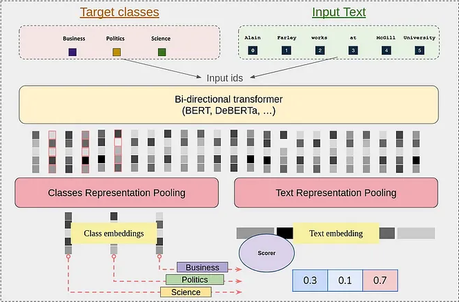

GLiClass UniEncoder employs BERT-like bi-directional encoder-only pre-trained language models as its backbone. The key innovation lies in how the model processes both the input text and candidate labels simultaneously in a single forward pass, eliminating the need for multiple text-label pair evaluations characteristic of cross-encoder approaches.The model concatenates class labels and input text using a structured prompt format with special tokens `<<LABEL>>` and `<<SEP>>`.

For example, classifying the text *"One day I will see the world!"* with candidate labels *["travel", "dreams", "sport"]*:
```
<<LABEL>>travel<<LABEL>>dreams<<LABEL>>sport<<SEP>>One day I will see the world!
```

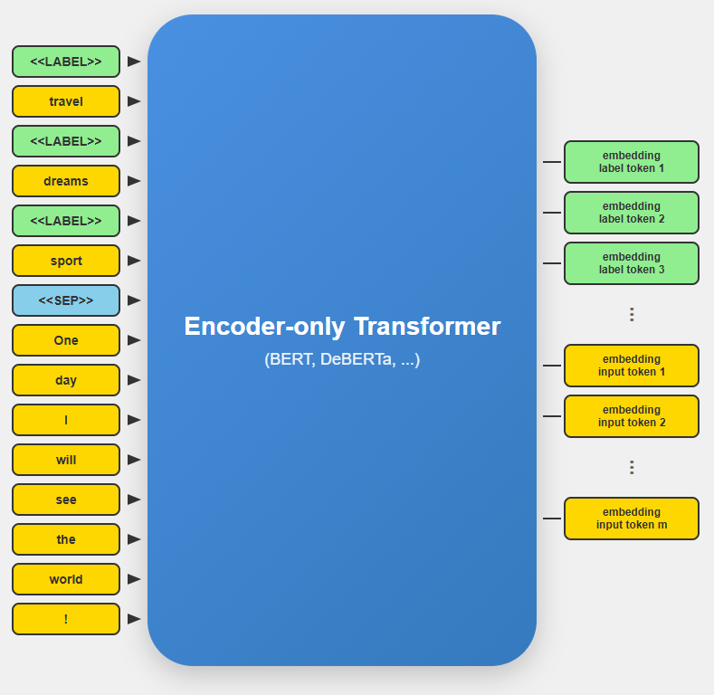

After the forward pass through the encoder model, the sequence representations are processed to extract meaningful embeddings for both text and class labels. After the input text tokens are pooled to create a unified text representation:

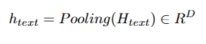

`H_text` represents the hidden states of text tokens and Pooling can be average, max, first token, or other pooling strategies.  
While for each class label `c`, the representation is extracted from the corresponding `<<LABEL>>` token position:

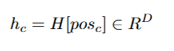

After this features extraction steps, both, text and class representations are projected through learned transformation layers

For output vector `t` (for texts) the pojection workflow will look as follows:

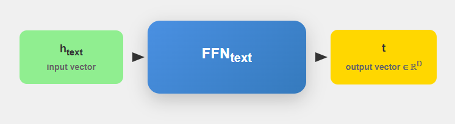

Similarly we can get `q_c` for classes:

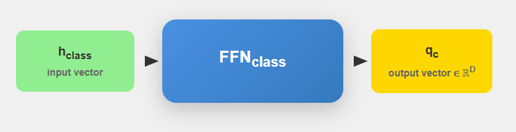

Once GLiClass have the projected embeddings we can move on to similarity calculations between text and classs. 
The similarity between text and each class is computed using various scoring mechanisms:

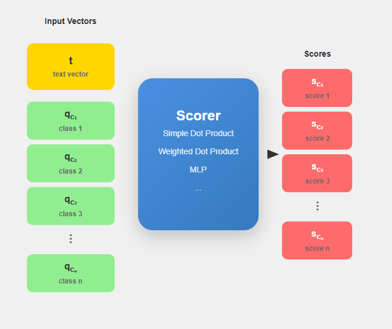

Final classification probabilities are obtained via [`sigmoid`](https://en.wikipedia.org/wiki/Sigmoid_function) activation for multi-label or [`softmax`](https://en.wikipedia.org/wiki/Softmax_function) for single-label scenarios:

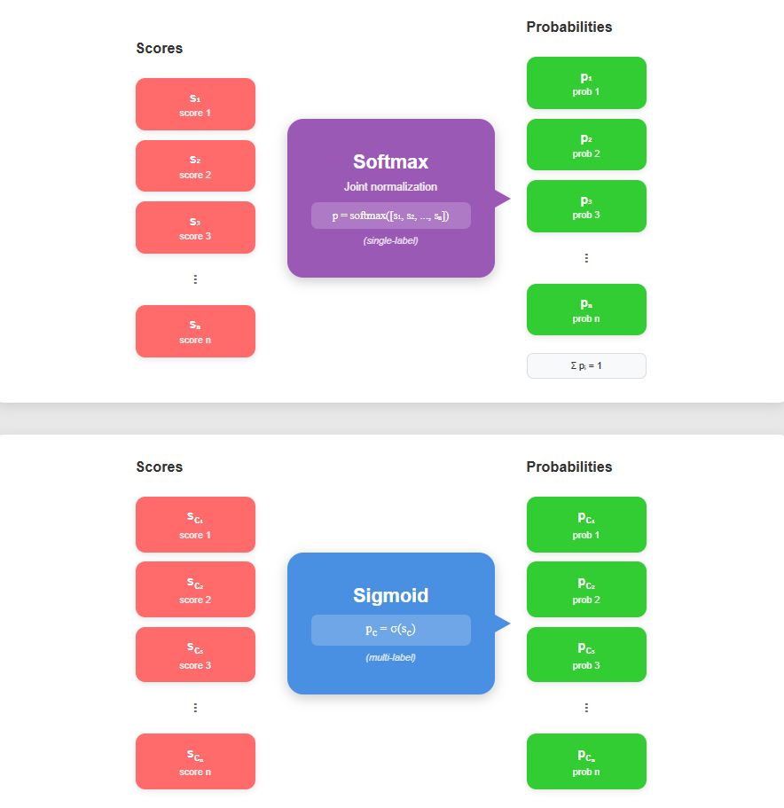

Training data follows a structured JSON format that works both for single-label and multi-label scenarios:

```json
{
  "text": "Sample text for classification",
  "all_labels": ["class1", "class2", "class3", "class4"],
  "true_labels": ["class1", "class3"]
}
```

For multi-label classification, GLiClass employs [Focal Loss](https://arxiv.org/pdf/1708.02002) to handle class imbalance

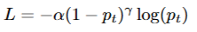

## GLiClass bi-encoder

While the UniEncoder architecture provides an effective single forward pass solution, it faces several limitations when scaling to scenarios with large label sets or frequent label reuse across different classification tasks. So despite efficiency of UniEncoder approach it encounters bottlenecks in some scenarios where performance degrades when the number of labels significantly exceeds the input sequence length. To address sucgh limitations, GLiClass introduces a BiEncoder architecture that decouples the encoding process of input text and class labels into two separate transformer models.

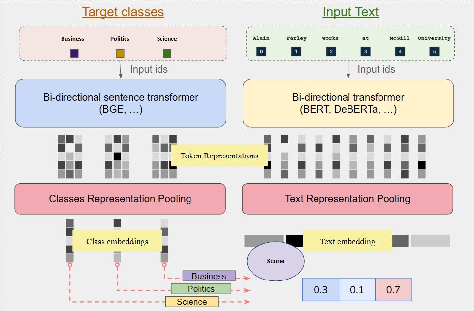
<details>
    - Text Encoder: Processes input text independently using a pre-trained language model
    - Label Encoder: Processes class labels separately using a dedicated sentence transformer model
</details>

GLiClass BiEncoder differs from Unicoder in that it can process classes and texts independently of each other.In our architecture, texts will be processed first

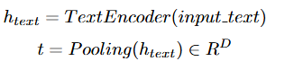

After the texts are encoded model will encode labels as follows:

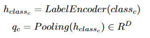

Since the text and label encoders may have different hidden dimensions, a projection layer aligns them

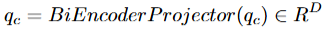

Overall BiEncoder flow looks as follows:

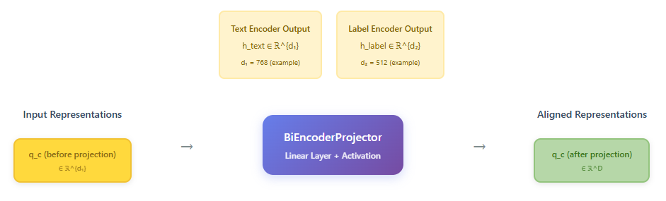


:::tip
With this knowledge you can safely start using our GLiClass [models](../pretrained-models/index.mdx). We also have prepared detailed [usage guide](../usage/index.md) for you.
:::