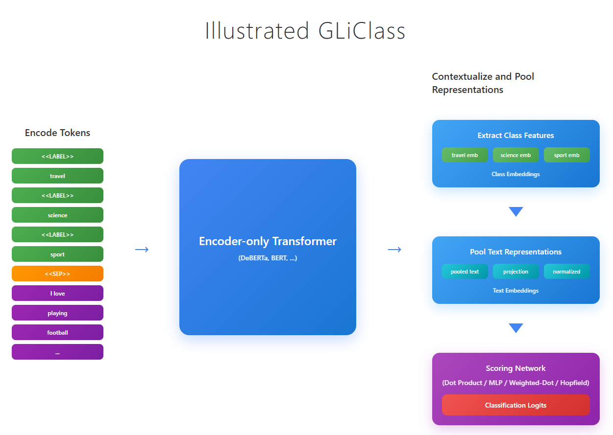
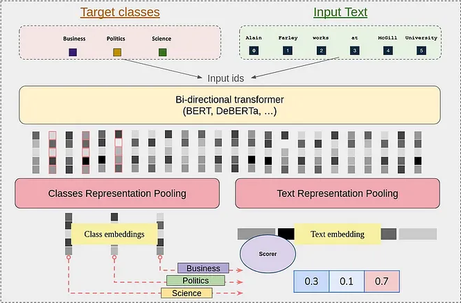

# Intro
GLiClass (Generalist and Lightweight Model for Classification) is a zero-shot sequence classification model capable of categorizing text into arbitrary label sets using a bidirectional transformer encoder (BERT-like). Inspired by GLiNER's approach to named entity recognition, GLiClass adapts the single forward pass paradigm for classification tasks, providing a practical alternative to traditional cross-encoder models that require separate inference for each text-label combination, and Large Language Models (LLMs) that, while flexible, are computationally prohibitive for resource-constrained production scenarios requiring fast, scalable text classification.

## Overview

GLiClass addresses the critical limitation of traditional cross-encoder classification models, which entails that such models require separate forward passes for each text-label pair, making them computationally prohibitive for scenarios with large label sets or real-time inference requirements. Furthermore, such models lack zero-shot generalization capabilities outside their training label distributions. While Large Language Models (LLMs) offer impressive zero-shot classification performance through in-context learning, they become an even less attractive choice given their substantial computational overhead and resource requirements in production environments.

Despite the above-mentioned limitations of traditional classification approaches, encoder-only models can still offer significant cost and computation savings given their smaller sizes, faster inference speeds, and ability to produce enriched contextualized representations through bi-directional attention. GLiClass bridges this gap by equipping lightweight encoder models with zero-shot classification capabilities, achieving approximately 10x faster inference compared to cross-encoders while maintaining competitive accuracy. This makes GLiClass a practical alternative to both traditional classifiers and LLMs, particularly in resource-constrained production settings.

With the above foreword, in this post I'd like to break-down the GLiClass architecture into its atomic pieces, focusing on the UniEncoder approach as the foundational architecture. GLiClass adapts the successful GLiNER paradigm from named entity recognition to sequence classification, enabling single forward pass inference for arbitrary label sets. The model supports both single-label and multi-label classification scenarios, incorporates advanced features like Retrieval-Augmented Classification (RAC) for few-shot enhancement, and offers flexible scoring mechanisms ranging from simple dot-product similarity to sophisticated attention-based approaches. This architectural flexibility allows GLiClass to scale efficiently across diverse classification tasks while maintaining the simplicity and speed advantages of encoder-only models.

## GLiClass uni-encoder

