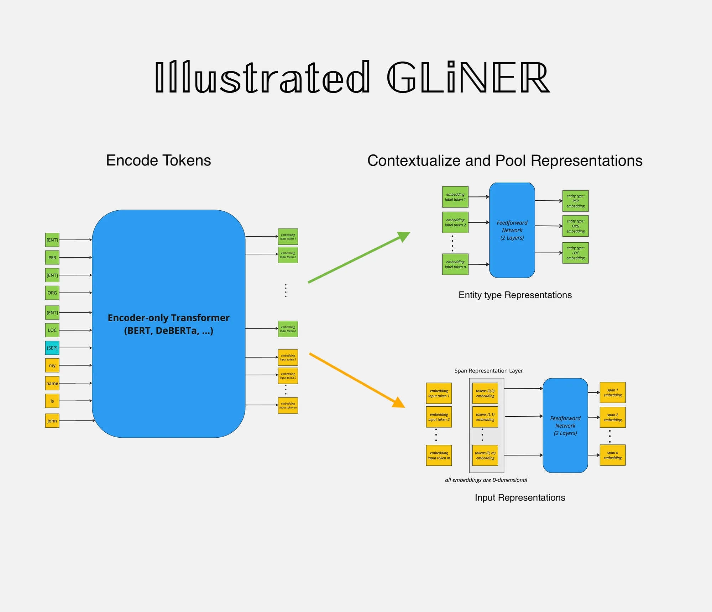
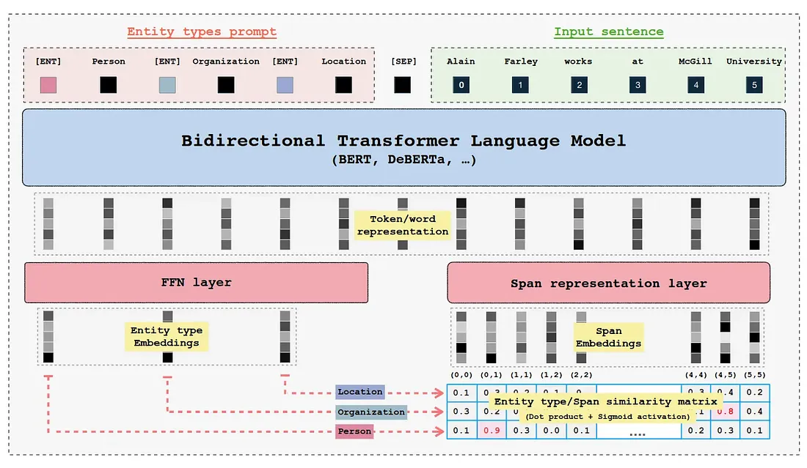
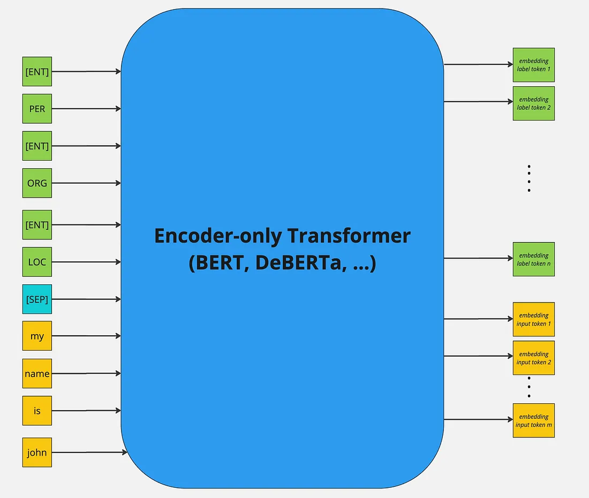
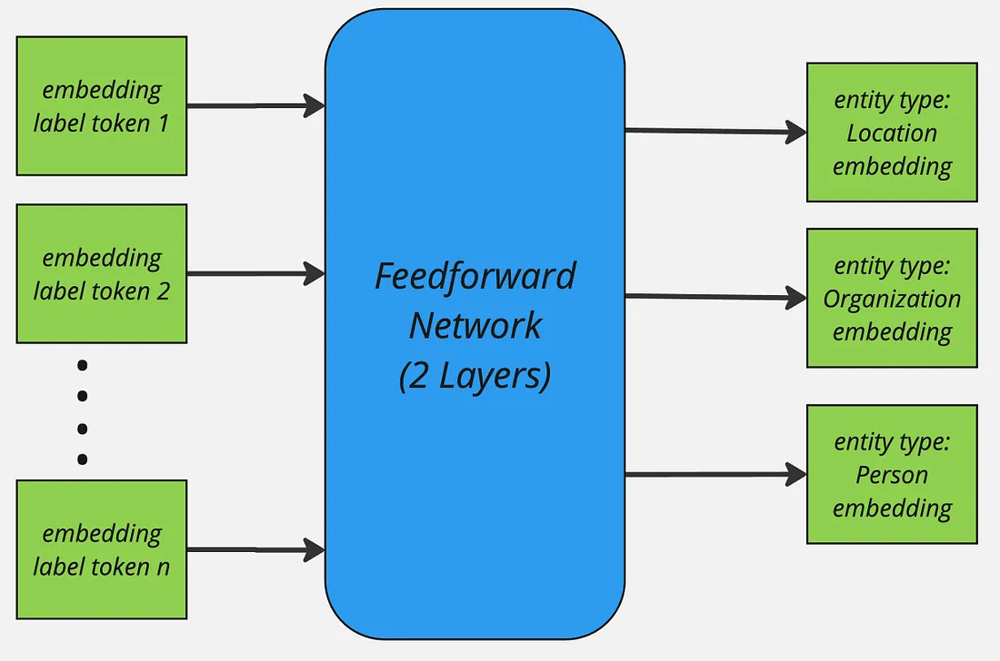
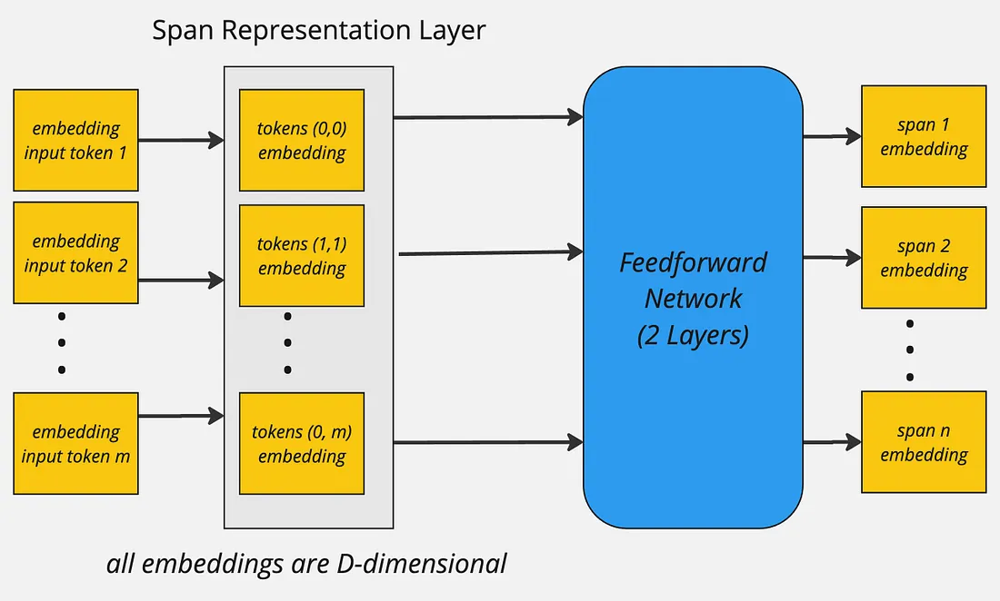
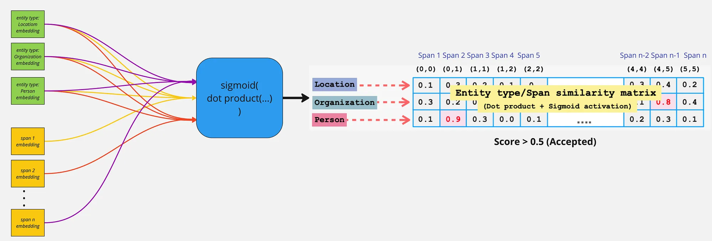
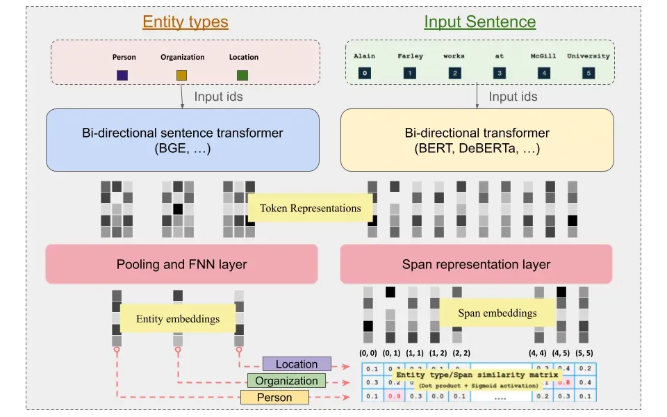
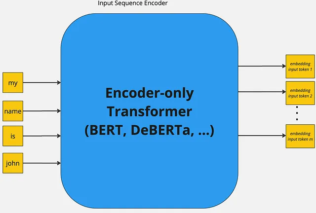
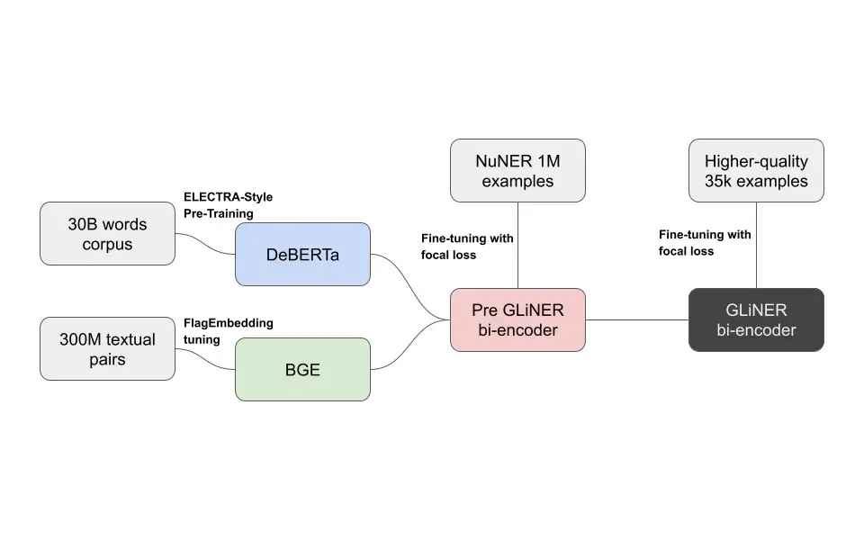

# Intro
GLiNER (Generalist and Lightweight Model for Named Entity Recognition) is a Named Entity Recognition (NER) model capable of identifying any entity type using a bidirectional transformer encoder (BERT-like). It provides a practical alternative to traditional NER models, which are limited to predefined entities, and Large Language Models (LLMs) that, despite their flexibility, are costly and large for resource-constrained scenarios.



## Overview
GLiNER addresses the critical limitation of traditional (BERT-like encoder-only) NER models, which entails that such models can only process a pre-defined set of discrete entities and lack zero-shot generalization capabilities outside the entity types of their training sets. Furthermore, such models become an even less attractive choice given the widespread proliferation of decoder-only LLMs. This is a byproduct of LLMs’ strong zero-shot performance mainly due to in-context learning and potential for further performance gains in few-shot regime.

Despite the above-mentioned limitations of encoder-only models, they can still offer significant cost and computation saving given their small-sizes, ability to produce more enriched contextualized token, word, and sequence representations thanks to bi-directional attention. Thereby, GLiNER equips them with zero-shot capabilities and makes them a competitive alternative to decoder-only LLMs more importantly in resource-constrained production settings.

With the above foreword, in this post I’d like to break-down the GLiNER architecture into its atomic pieces. Furthermore, there has been significant follow-up work on the original GLiNER architecture allowing the approach to extrapolate beyond NER to Extractive Question-answering, Open Information Extraction, Extractive Summarisation, Relation Extraction, and Open NER proposed in the GLiNER paper. Lastly, another facet of GLiNER that was most recently was to optimise its computational performance by de-coupling the entity-type and input sequence encoding processing into two different model. Hence, allowing for the possibility of pre-computing entity-type representations just once saving unnecessary computation. This speeds-up performance when the `num_tokens(entity_types) > num_tokens(input_sequence)` condition is present.

## Vanilla GLiNER



### Training Approach
GLiNER primarily employs BERT-like bi-direction encoder-only pre-trained language models. Further more both the entity labels and input sequence are concatenated and then passed through the encoder model. The standard `[SEP]` special token is used to indicate the boundary between entity labels and input sequence. Whereby, to represent boundary for each entity-type a special token `[ENT]` is placed before each entity type moreover, the embedding of this token is initialised randomly at the beginning of training.



After the forward-pass of the encoder model the `[ENT]` token representations represent each of their preceding entity label and are passed through a two-layer feedforward network for further refinement. The resulting entity representation for an entity type `t` can be expressed as:




Similarly, the input sequence tokens are combined to form spans for instance (assuming no word is split into subword tokens):

```python
input_sequence = "my name is john"
tokens = ["my", "name", "is", "john"]
spans = [
    ["my"],
    ["name"],
    ["is"],
    ["john"],
    ["my", "name"],
    ["name is"],
    ["is", "john"],
    ...
]
```
In case if the word is split into more than one tokens the first token and the last token are used to mark span boundaries and their representations are further used. Finally the span representations are computed, more for a span starting at index `i` and ending at `j`, the span representation for span `Sij` can be computed as:




The resulting span representation would be D-dimensional vector:


The above process is applied to all spans on their token representations to compute unified span representations. To keep the computational overhead in-check the maximum span length is set to 12.

Lastly, to compute whether a given span belongs to a entity label the sigmoid activation is applied on the dot-production of entity label and span representation:




To train the model on the sigmoid activations for each span and entity label interaction score Binary Cross Entropy loss is employed to classify between positive and negative instance of span and entity label interaction scores.

### Span Decoding
To infer spans whether a give interaction score represents a particular entity type firstly, non-entity spans are removed by thresholding on interaction scores:


Furthermore, two decoding strategies are proposed:
- Flat NER: Highest scoring non-overlapping spans are selected exhaustively.
- Nested NER: Similar to Flat NER, but allow for overlapping spans except partial overlaps.

## GLiNER Multi-task
As discussed in the overview, the GLiNER Multi-task work extends the original GLiNER architecture to new tasks including Extractive Question-answering, Open Information Extraction, Extractive Summarisation, Relation Extraction, and Open NER. Furthermore, it also explore synthetic label generation using Llama 3 8B LLM for the aforementioned tasks. Lastly, it also evaluates model’s self-learning capability where the pre-trained GLiNER Multi-task model initially generates weak labels for the task and then those labels are used to fine-tune the model resulting in significant gains in model generalisation on the downstream dataset.

### Architecture & Training Approach
The GLiNER multi-task model uses tokens instead of spans for input sequence processing. This allows models to perform well on long-form prediction generation tasks such as summarisation and long entity extraction etc. Since a given extractive summarisation can potentially be multiple sentences long thereby, spans could be limiting factor here.

During the forward pass of the model the the input sequence and labels are concatenated employing the identical mechanism to the original work. After the encoding the input sequence and labels, the input sequence’s token embeddings are passed through a bi-directional LSTM, the authors argue that the introduction of this LSTM speeds up and stabilises the training against negative tokenisation and positional encoding artefacts (The paper does not provide any ablation studies to reinforce this point further). Finally, both label and input sequence’s token representations are refined further by passing via feedforward network which projects the token representations to higher dimensional space (2x times larger than original hidden dimension). The forward pass more formally look as follows (Note: I omit the batch dimension to simplify overall notation):

Let `T` be the token representations of input sequence and `L` be the token representations of labels. Where `M` is the input sequence length and `C` is the number of unique labels. `T’`, `T’’` represent refined input sequence and label representations in high-dimensional latent space.


Both `T’` and `L’` are element-wise multiplied across the axis `D` with `T’` and resulting in `M×C×2×D` dimensional matrices which then are re-permuted as:


To better capture interactions between input sequence and labels element-wise dot product between refined token representations is concatenated to whilst also concatenating `T’’’` and `L’’’` together across the last dimension `D`. Importantly, first dimension is kept as it is whereby the last dimension is element-wise multiplied.


Afterwards the concatenated representations are passed through a FFN. To generate token-level classification scores for each class generating three logits corresponding to start, end, score. Let `S` be the score matrix then:


### Decoding Spans
To determine whether a given token is positively interacting with a label scores, Flat NER decoding approach is used with a difference that scores are averaged for entire span:


### Self-training
The pre-trained model is used to generated initial weak labels for domain NER benchmark and then model is fine-tuned on the weak labels by employing label smoothing which prevents the model to become over-confident on ground truth labels. This is beneficial when annotated labels are not GOLD standard.

Essentially label smoothing acts as regularisation as it steals probability mass from correct label and distributes that to other classes hence, avoiding overfitting. For binary classification tasks the loss function with label smoothing looks like:


Here `alpha` is the smoothing parameter.

## GLiNER Bi-encoder and Poly-encoder



Although the original GLiNER architecture provides an powerful alternative to extract entities in zero-shot regimes. However, the model still have performance bottlenecks and limitations:

Entities representations are conditioned on their order due to positional encoding layer of transformer.
The model’s performance degrades when number of entity labels exceed 30.
Joint entity label and input sequence representation create significant overhead specially when the number of entity tokens are greater than input sequence tokens. As most of entity labels won’t be present in the given smaller input sequence hence, forward pass (bi-directional attention, FFN etc.) on those un-matched entity types wastes the compute.

### Architecture & Training Approach
To address the above-mentioned shortcomings of the original architecture, the authors of GLiNER multi-task also propose this extension of GLiNER, albeit as a completely separate work from the multi-task paper. Two architectures are proposed, namely:

Bi-encoder: The key idea behind their approach is to de-couple the encoding process of entity labels and input sequence. This allows for pre-computation of entity types just once resulting in more efficient acquisition of entity type representation. The authors employ pre-trained sentence transformers as entity type encoder and the original BERT-like model for encoding input sequence (identical to the original work).
Poly-encoder: This encoder uses the representations produced by entity label and input sequence encoders and fuses them together to capture the interactions between them to capture additional signal similar to the original BiLM.



The subsequent steps after encoding, in order to obtain coarser label and span embeddings remain unchanged when compared to the original work.

Advantages of de-coupled Encoders:
- Recognise large number of entities significantly beyond original maximum 30 entities without significant performance degradation
- Faster inference and robustness on out of distribution data, hence, solidifying zero-shot performance.

### Training Approach

The de-coupled GLiNER model uses pre-trained DeBERTa (input sequence encoder) and BGE (entity type encoder) models as encoders which are trained in two stages.

GLiNER bi-encoder is jointly pre-trained on one million NER samples in a supervised fashion. This stage focuses mainly on aligning entity label representations with span representations.
At stage two, the pre-trained bi-encoder is further fine-tuned on **35k** higher quality input sequence and entity types. This stages enhances the model performance on the NER task itself by refining the fidelity of representations.



### Training Considerations

The batch size can greatly influence the model generalisability. As, larger batch size leads to more stable training and less noisy gradients. However, as it pertains to span to entity label interactions, the larger the batch size, the more negative interactions would be produced, leading to model which has higher entropy in its decision boundary. Here, author mitigate this effect by using a weighted loss more formally known as focal loss.

The key intuition behind focal loss is to mitigate class imbalance which is highly likely for larger batches. Focal loss can more formally be defined as:


`pt` refers to probability of target class
- α is to control the influence positive and negative samples within batch to reduce effect of class imbalance
- γ further reduces the loss values on correctly classified samples (i.e. easy samples) so that model can focus on miss-classified (hard samples) hence further reducing effect of majority negative examples

## References
- The Intro section is based on the [Shahrukh Khan](https://www.linkedin.com/in/shahrukhx01/) article [Illustrated GLINER](https://medium.com/@shahrukhx01/illustrated-gliner-e6971e4c8c52) and placed into documentation with consent of the author.
- [Urchade Zaratiana, Nadi Tomeh, Pierre Holat, and Thierry Charnois. 2023. Gliner: Generalist model for named entity recognition using bidirectional transformer](https://arxiv.org/abs/2311.08526)
- [Ihor Stepanov, and Mykhailo Shtopko. 2024. GLINER MULTI-TASK: GENERALIST LIGHTWEIGHT MODEL FOR VARIOUS INFORMATION EXTRACTION TASKS](https://arxiv.org/abs/2311.08526)
-[Meet the new zero-shot NER architecture | by Knowledgator Engineering | Aug, 2024 | Medium](https://blog.knowledgator.com/meet-the-new-zero-shot-ner-architecture-30ffc2cb1ee0)